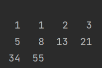

## 二、填空题
 1、以下程序的功能是生成全部小写字符的循环方阵，每行向左循环2位，请观察代码并完成第2题。
- 样例代码演示：
```c
#include<stdio.h>

void main() {
    for (int i = 0; i <= 50; i += 2) {
        for (int j = 0; j <= 25; j++)
            if ((i % 26) + j >= 26)
                printf("%c ", 'a' + (i % 26) + j - 26);
            else
                printf("%c ", 'a' + (i % 26) + j);
        printf("\n");
    }
}
```
2、以下程序的功能是生成0-9全部数字的循环方阵，每行向左循环2位，请补全其中代码。
- 答案代码演示：
```c
#include<stdio.h>

void main() {
    for (int i = 0; i <= 50; i += 2) {
        for (int j = 0; j <= 9; j++)
            if ((i % 10) + j >= 10)
                printf("%c ", '0' + (i % 10) + j - 10);
            else
                printf("%c ", '0' + (i % 10) + j);
        printf("\n");
    }
}
```
3、以下函数的功能是在数组s中从指定位置start处开始反向查找元素x并返回位置p。
- 样例代码演示：
```c
int search(int s[],int Length,int x,int* p,int start){
    for(int i= start;i>=0 ;i--){
        if(s[i]==x){*p=i+1; return 1;}
    }
    return 0;
}
```
若函数返回值为0，表示 在待查找范围内没有找到元素x。 

4、有如下程序
- 样例代码演示：
```c
#include<stdio.h>

main() {
    int a, b;
    scanf("%d%d%d", &a, &b);
    printf("%d\n", m(a, b));
}

m(int x, int y) {
    int t;
    return (t = x < y ? x : y);
}
```
- 问题： 该程序的功能是 ________ 
- 答案：( 从键盘中输入2个数，并输出这2个数之间最小的一个数 )

## 三、读程序写运行结果

1、问题一，有如下程序：
- 样例代码示例：
```c
#include<stdio.h>

int fun(int n);

void main() {
    int num = 1;
    for (int i = 1; i >= 10; i++)
        num += fun(i);
    printf("%d", num);
}

int fun(int n) {
    if (n <= 1)
        return 1;
    else
        return n * fun(n - 1);
}
```
- 问题：程序运行结果为 ________
- 答案：( 1 )

2、问题二，有如下程序：
```c
#include<stdio.h>

void main() {
    int x[] = {10, 20, 30, 40, 50};
    int *p;
    p = x;
    printf("%d", *(p + 2));
}
```
- 问题：程序运行结果为 ________
- 解析：
> (1) 运行程序观察结果。 \
> (2) 根据指针的特性，当p=x时，p指向了数组第一个元素10，当p+2时，指针会指向数组的第三个元素，也就是从在数组中下标为0变为2，而下标为2的数组元素即30。因此答案为30。
- 答案：( 30 )

3、问题三，有如下程序：
```c
#include<stdio.h>

void main() {
    int i, f[10];
    f[0] = f[1] = 1;
    for (i = 2; i < 10; i++)
        f[i] = f[i - 2] + f[i - 1];
    for (i = 0; i < 10; i++) {
        if (i % 4 == 0)
            printf("\n");
        printf("%2d  ", f[i]);
    }
}
```
- 问题：程序运行结果为 ________
- 答案：(  )

4、问题四，有如下程序：
```c
#include<stdio.h>

func(int x) {
    x = 10;
    printf("%d, ", x);
}

void main() {
    int x = 20;
    func(x);
    printf("%d", x);
}
```
- 问题：程序运行结果为 ________
- 答案：( 10, 20 )

5、问题五，有如下程序：
```c
#include "stdio.h"

main() {
    int a[10] = {100, 3, 6, 4, 9, 1, 5, 8, 2, 7}, k = 0, i, j, t;
    for (i = 1; i < 9; i++)
        for (j = i + 1; j <= 9; j++)
            if (a[i] > a[j]) {
                t = a[i];
                a[i] = a[j];
                a[j] = t;
            }
    for (i = 1; i < 10; i++)
        printf("%5d", a[i]);
}
```
- 问题：程序运行结果为 ________
- 答案：(  )

6、问题六，有如下程序：
```c
#include "stdio.h"

main() {
    int i, j;
    char x[6] = {'h', 'e', 'l', 'l', 'o', '\0'}, t;
    for (i = 0; i < 5; i++)
        for (j = i + 1; j < 5; j++)
            if (x[i] < x[j])
                t = x[i], x[i] = x[j], x[j] = t;
    printf("%s", x);
}
```
- 问题：程序运行结果为 ________
- 答案：( ollhe )　　　　　　　